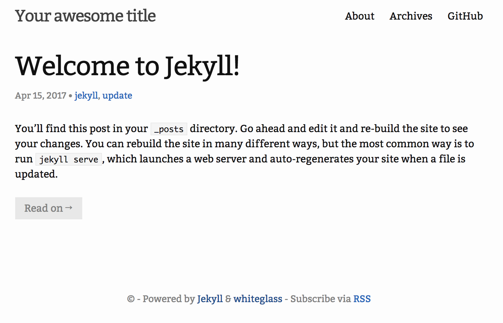

# jekyll Introductory Workshop!

[Jekyll](https://jekyllrb.com/) is a static site generator that automates a lot of the site creation progress. It's popular for personal and blogging sites. But don't confuse Jekyll with blogging software- although there are many templates available for use with Jekyll, Jekyll is fundamentally parsing software that makes it easier for you to make your website. Jekyll will interpret what you give it, be it markdown files, layout information etc. and construct your website.

Still confused? By the end of this workshop you will learn how you can use Jekyll to start a personal blogging website.

## Getting started

Before you start using jekyll, you need to install it first! The instructions for mac and windows installation are below.

### Mac
1. Your computer probably comes with Ruby installed! You can verify this with which ruby. If you don't get a path returned, you can easily install ruby with Homebrew. If you plan on doing more serious development with Ruby, you should look into an environment manager, like rbenv, but that's beyond the scope of this workshop.
2. Now you need to be able to install "gems", which are Ruby packages. RubyGems is the Ruby standard for publishing and managing third party libraries. If you installed Ruby with Homebrew or an environment manager, RubyGems should be installed by default. Check if you have gems installed by running the which gem command. If you don't get a path returned, you can download RubyGems here.
3. Last step: it's time to install some gems specific to Jekyll. To do this, simple execute gem install jekyll bundler. If you didn't install Ruby with homebrew or rbenv, you may have to run sudo gem install jekyll bundler.

#### What does the `bundler` gem do?

- Bundler provides a consistent environment for Ruby projects by tracking and installing the exact gems and versions that are needed.

### Windows
There's a known issue with Ruby on Windows that makes the installation process a little more difficult for first-time users. However, once RubyGems is installed correctly the first time, RubyGems will work just fine. More info can be found [here](http://guides.rubygems.org/ssl-certificate-update/#installing-using-update-packages).
1. Check if you already have Ruby installed. Run your terminal as an administrator (right click when opening and choose, "Run as administrator") and type `ruby -v`
   1. If that gives you a version number, go to step 2!
   2. If not, install Ruby (either by Chocolatey/your preferred Windows package manager or manually).
2. Gem is Ruby’s package manager (similar to NPM for Node). However, due to a bug with windows, in order to get Gem you need to download the gem file manually.
    1.  Go to [the RubyGems download site](https://rubygems.org/pages/download#formats). Choose the zip version, and unzip it in a easily-reachable directory (like C:\, C:\Documents, etc)
    2.  cd into the directory where you unzipped it.
    3. Run in terminal: `gem install --local your_directory_path\rubygems-update-2.6.10.gem `, replacing `your_directory_path` with the directory you chose. For example, my command says, `C:\>gem install --local C:\rubygems-update-2.6.10.gem`
3. Update RubyGems! type in terminal, `update_rubygems`.
4. To make sure the gem installed correctly, type `gem --version`.
    1. If that gives you a version number, great! Go to step 5. :smile:
5. The rubyUpdate gem can be safely uninstalled. Type `gem uninstall rubygems-update -x`.  


## Starting a jekyll project

`jekyll new blog`

`cd blog`

## Serving your project on a browser
The command `bundle exec jekyll serve` will run your files on `localhost:4000`
It’s a barebones look right now though- the default `minima` theme
You can now close the server with `ctrl+c`

## Adding a theme
Feel free to use choose your own theme from [JekyllThemes.org](http://jekyllthemes.org/), but we’ll be walking you through how to use the [`whiteglass` theme](https://github.com/yous/whiteglass).

Edit `_config.yml` to use whiteglass theme and its plugins (replace lines 29-31 with the following):


```
theme: jekyll-whiteglass
gems:
  - jekyll-archives
  - jekyll-paginate
  - jekyll-sitemap

permalink: /:year/:month/:day/:title/
paginate_path: /posts/:num/
paginate: 5

jekyll-archives:
  enabled:
    - categories
  layout: category_archives
  permalinks:
    category: /categories/:name/
```

Now, replace line 15 of your `Gemfile` with: `gem "jekyll-whiteglass"`

You can see what other plugins exist at https://jekyllrb.com/docs/plugins/#available-plugins

The theme also comes with some helpful defaults like an about and an archives page. You can add these files to your blog by running:
```
rm index.md
curl -L -O "https://github.com/yous/whiteglass/raw/master/{index.html,about.md,archives.md,feed.xml}"
curl -L --create-dirs -o _data/navigation.yml https://github.com/yous/whiteglass/raw/master/_data/navigation.yml
```

Because you added gems to `_config.yml` and `Gemfile`, you need to install them with `bundle install`

Now you can simply run `bundle exec jekyll serve` and the blog will be available at [http://127.0.0.1:4000](http://127.0.0.1:4000)

This is what your site should now look like:



## What's Happening?
One of the best parts of using Jekyll is the ability to modularize your page layouts and your posts. Jekyll knows how to read that by the different folders in the directory. For example, the compiled site will be in the `_sites` folders (don't put files there, as they'll only be overwritten). Blog posts will be in `_posts`.

A popular practice with Jekyll is to _modularize_ your code-- that is, create elements of the page (ex headers, nav bars, footers) that have a predefined style and to include them as separate .html files.

Let's try customizing this theme's layout!

## Making a Layout
Create a directory called `_includes`.
```
mkdir _layouts
cd _layouts
```
Then, copy the file in `_includes/footer_content.html` and paste it into your newly-created `_includes` folder.
Copy and paste the following code to the end of your file:
```
<link rel="icon" type="image/x-icon" href="{{ "/favicon.ico" | relative_url }}">
```
Check to make sure your page still looks nice :)

This is the same method used to edit the CSS in the site.


## Workshop Overview

* [10-15 Minute Intro Presentation](#presentation-section)
* [30 Minute Tutorial](#tutorial-section)
* [5-10 Minute Wrap-Up Discussion](#wrap-up-discussion-section)

## Teams

Teams of ~5 will be formed around dates and a set of potential topics. Your and your team may chose 1 or 2 technologies from the list or may suggest alternative related technologies/topics.

## Setup

If your tutorial requires any lengthy download or install procedures please let the class know at least 2 days in advance.

## Details


### Presentation Section

~(10-15 minutes)

* motivate the technology
* show where the technology fits into the web dev process (dev tool, frontend framework, preprocessor, language etc)
* show some use cases
* discuss pros/cons

You may use any presentation technology, although [reveal.js](https://github.com/hakimel/reveal.js) is particularly fitting as an open source javascript library, and supports code blocks. :gem:

### Tutorial Section

(~30 minutes)

Your written tutorial document will be a walkthrough of building something using the specific web technologies.

It should include:

* Overview of what will be attempted
* Any necessary setup steps
* Step by step instructions
* Explanations of the what **and** the why behind each step. Try to include:
  * higher level concepts
  * best practices

Remember to explain any notation you are using.

```javascript
/* and use code blocks for any code! */
```

Use screenshots

:sunglasses: GitHub markdown files [support emoji notation](http://www.emoji-cheat-sheet.com/)

Here's a resource for [github markdown](https://guides.github.com/features/mastering-markdown/).

### Wrap-Up Discussion Section

(~5-10 minutes)

* lead short discussion
* answer questions
* individual teams share results
