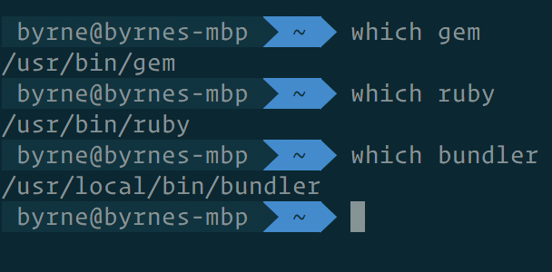
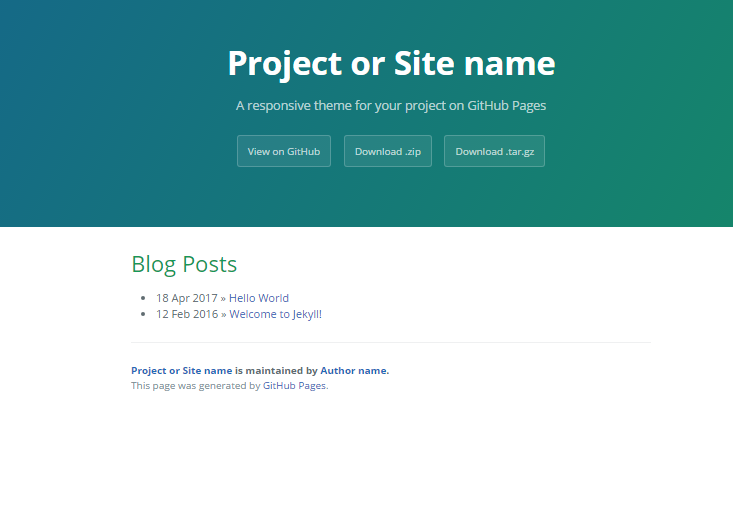
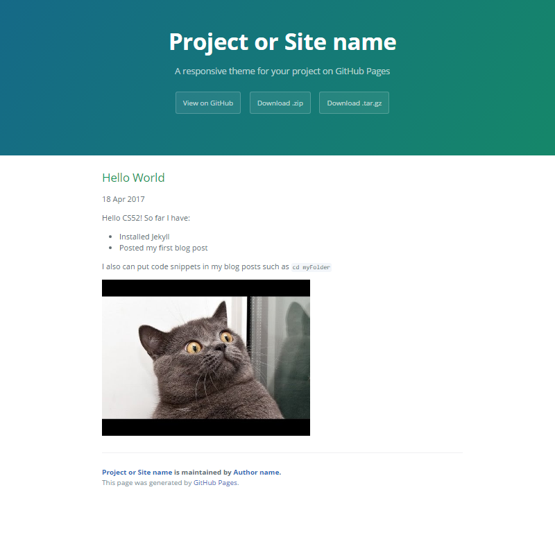
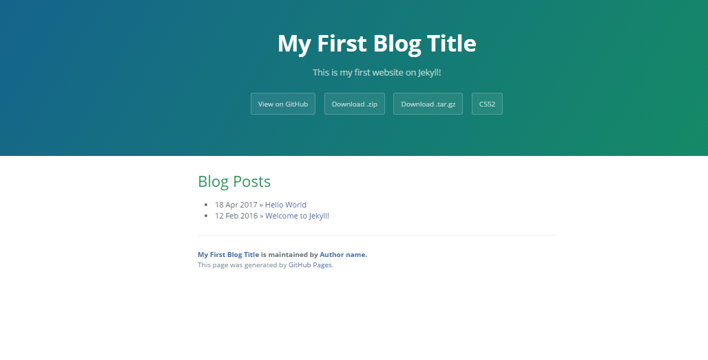
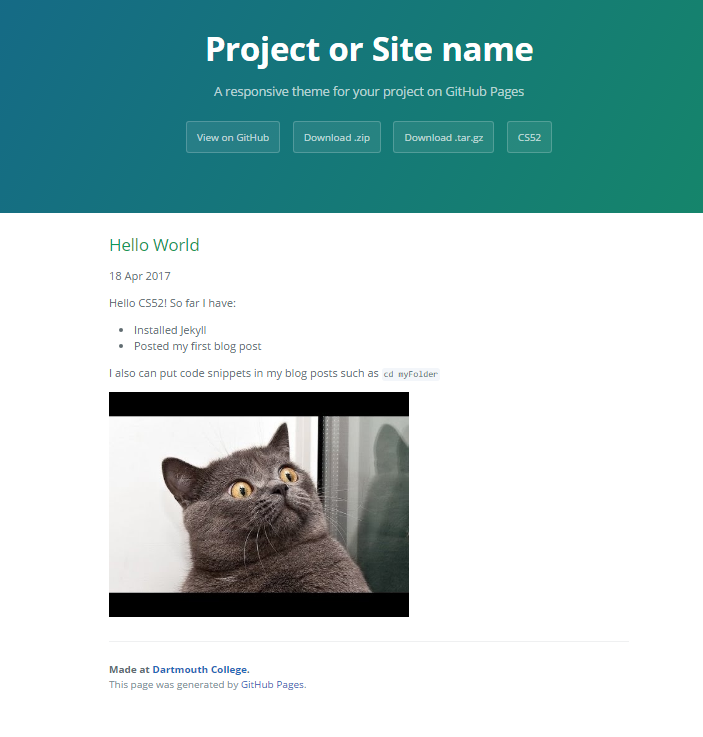

# Jekyll Introductory Workshop!

[Jekyll](https://jekyllrb.com/) is a static site generator that automates a lot of the site creation progress. It's popular for personal and blogging sites. But don't confuse Jekyll with blogging software- although there are many templates available for use with Jekyll, Jekyll is fundamentally parsing software that makes it easier for you to make your website. Jekyll will interpret what you give it, be it markdown files, layout information etc. and construct your website.

Still confused? By the end of this workshop you will learn how you can use Jekyll to start a personal blogging website.

## Workshop Overview
To complete this workshop, follow the following steps:

1. [Getting Started- Install Jekyll](#getting-started)
2. [Start a new Jekyll Project](#starting-a-jekyll-project)
3. [Serve your first project](#serving-your-project-on-a-browser)
4. [Add a Theme](#adding-a-theme)
5. [Make your first post](#make-your-first-post)
6. [Customize your Theme](#customize-a-theme)

Be sure to look out for the following notations:
* :computer: run in terminal
* :rocket: this is a key step
* :warning: watch out!
* :question: explanation section- what is going on here?
* :white_check_mark: checkpoint reached!

## Getting started

Before you start using jekyll, you need to install it first! The instructions for Mac and Windows installation are below.

### Mac :rocket: :computer:

By the time you're done with this section, your terminal should look very similar to this one (all `which` does is locate a program file in the user's path; if a path shows up, it's *probably* properly installed):



1. Jekyll is a parsing engine bundled as a ruby gem, so you definitely need Ruby to get started. Thankfully, your computer probably comes with Ruby installed! You can verify this with `ruby -v`. It should return with Ruby version 2.0.0 or higher. (If you plan on doing more serious development with Ruby, you should look into an environment manager, like [rbenv](https://github.com/rbenv/rbenv), but that's beyond the scope of this workshop.)
If for some reason you’re running a lower version, you can update with:
```
sudo gem install ruby
```
If for some reason this command doesn't work, run `which gem`. If a path is not returned, download RubyGems [here](https://rubygems.org/pages/download/) and then try to update Ruby.

2. Now you need to be able to install "gems", which are Ruby packages. RubyGems is the Ruby standard for publishing and managing third party libraries. You should have it installed by now. You can use it to install `bundler`, a package manager that will help you install all the Jekyll dependencies. Run:

```
sudo gem install bundler
```

### Windows :rocket: :computer:
There's a known issue with Ruby on Windows that makes the installation process a little more difficult for first-time users. However, once RubyGems is installed correctly the first time, RubyGems will work just fine. More info can be found [here](http://guides.rubygems.org/ssl-certificate-update/#installing-using-update-packages).
1. Check if you already have Ruby installed. Run your terminal as an administrator (right click when opening and choose, "Run as administrator") and type `ruby -v`
   1. If that gives you a version number, go to step 2!
   2. If not, install Ruby (either by Chocolatey/your preferred Windows package manager or manually).
2. Gem is Ruby’s package manager (similar to NPM for Node). However, due to a bug with windows, in order to get Gem you need to download the gem file manually.
    1.  Go to [the RubyGems download site](https://rubygems.org/pages/download#formats). Choose the zip version, and unzip it in a easily-reachable directory (like C:\, C:\Documents, etc)
    2.  cd into the directory where you unzipped it.
    3. Run in terminal: `gem install --local your_directory_path\rubygems-update-2.6.10.gem `, replacing `your_directory_path` with the directory you chose. For example, my command says, `C:\>gem install --local C:\rubygems-update-2.6.10.gem`
3. Update RubyGems! type in terminal, `update_rubygems`.
4. To make sure the gem installed correctly, type `gem --version`.
    1. If that gives you a version number, great! Go to step 5. :smile:
5. The rubyUpdate gem can be safely uninstalled. Type `gem uninstall rubygems-update -x`.  


## Starting a jekyll project
:rocket: Now that you have the prerequisites set up, let's download our first theme.
1. Go to [this link](http://github.com/pietromenna/jekyll-cayman-theme/archive/master.zip) and download the zip file for the Cayman theme. Cayman is pretty popular, and it works with Github-pages pretty well--notice anything familiar?

2. Unzip the folder.
:warning: When you unzip the folder, make sure to put it somewhere where you'll remember it. This will be where your project lives!

3. Then, `cd` into where all the files are. This might take 1 or 2 `cd`s depending on the unzip.

4. `bundle install` will install all the gems you need for the project.
:warning: If you run into errors while running `bundle install`, (aka non-mac people), you might need to run your terminal as an administrator.

Here's a brief overview of what each file is for:

- **_config.yml** Stores configuration data.
- **_includes** This folder is for partial views.
- **_layouts** This folder is for the main templates your content will be inserted into. You can have different layouts for different pages or page sections.
- **_posts** This folder contains your dynamic content/posts. the naming format is required to be `@YEAR-MONTH-DATE-title.MARKUP@`.
-  **_site** This is where the generated site will be placed once Jekyll is done transforming it.
- **assets** This folder is not part of the standard jekyll structure. The assets folder represents any generic folder you happen to create in your root directory. Directories and files not properly formatted for jekyll will be left untouched for you to serve normally.

## Serving your project on a browser

:rocket: You are now ready to serve your initial site using the command `bundle exec jekyll serve` Your site will now be accessible locally at `http://localhost:4000`

You should see something similar to this:


You can now close the server with `ctrl+c` and launch it again at any time with `jekyll serve`

:white_check_mark: You have now successfully created your first jekyll site and served it locally!

## Changing themes
As mentioned initially, Jekyll is designed to parse your files so that you can create your website easily. However, there are many themes available that you can use to easily make your site look a little nicer. Feel free to use choose your own theme from [JekyllThemes.org](http://jekyllthemes.org/), but we’ll be walking you through how to use the [`cayman` theme](https://github.com/pietromenna/jekyll-cayman-theme). Only [a few themes](https://pages.github.com/themes/) are fully supported by GitHub pages... Cayman does though. If you want to very easily deploy to GitHub pages, use the [Jekyll theme chooser](https://help.github.com/articles/creating-a-github-pages-site-with-the-jekyll-theme-chooser/) if/when you change the theme.

## Make your First Post!
Now that your site is looking a little more aesthetically pleasing, let's make your first blog post. With Jekyll, you can maintain/publish a blog post simply by managing a folder of files on your computer. All of your posts will live in the folder `_posts`.

:rocket: To create a new post, make a new Markdown file within the `_posts` folder with the following format for the file name:
```
YEAR-MONTH-DAY-TITLE.md
```

For example to create a blog post titled 'hello world' enter the following into terminal:
```
touch 2017-04-18-hello-world.md
```
:rocket: At the top of this file, add the following lines of code.
```
---
layout: post
title:  "Hello World"
date:   2017-04-18 04:16:13 -0400
categories: jekyll
---
```

:question: The content in between the three-dashed lines is known as YAML Front Matter and Jekyll will parse these variables in converting your file into the HTML for your site. For example, the `layout` variable will tell Jekyll to utilize the `post` layout.

:warning: All blog post files must start with this YAML Front Matter!

:rocket: Now, underneath the YAML Front Matter, you can write the content of your Blog Post in Markdown.
For example, copy the following lines to the bottom of the file:
```

Hello CS52! So far I have:
* Installed Jekyll
* Posted my first blog post

I also can put code snippets in my blog posts such as
`cd myFolder`

```

Your home page should now look like this.




:rocket: To add a picture to your post, you can use Markdown syntax for adding an image:

```

```
The following image should now appear in your blog post:


:white_check_mark: You have now successfully created a blog post! It should look something along the lines of this:


## Customization
### What's Happening? Understanding the Directory Structure of Jekyll themes
One of the best parts of using Jekyll is the ability to modularize your page layouts and your posts. Modularization is where certain elements such as a layout or headers/footers have a predefined style.

Jekyll reads this information through the different folders in the directory. For example, the compiled site will be in the `_sites` folders
(:warning: don't put files there, as they'll only be overwritten). Blog posts will be in the `_posts` directory.
We will now explore more of what is actually going on inside the directory.

#### The `_config.yml` File: Change your site Title
The `_config.yml` file holds settings that affect your whole blog that are typically set once initially. For example this is where you set your Site Title and Tile Description.

:rocket: Edit the `title` and `description` variables of the `_config.yml` file to personalize your website.

```
title: My First Blog Title
email: mypersonalemail@dartmouth.edu
tagline: This is my first website on Jekyll!
```
#### Updating the Navigation Bar
The `Cayman` theme also allows you to control your navigation bar through the `page-header.html` file in the `_includes` directory.

:rocket: Add a Link to the CS52 website onto your Navigation Bar by adding the following lines to the `page-header` file:
```
<a href="https://cs52.me" class="btn">CS52</a>
```
:white_check_mark: You have now personalized your site with your own title and additions to the navigation bar such as this:



### More on directory structure and how theme customization works
As mentioned above, Jekyll sites utilize modularization where an element such as a footer can be pre-defined as being on every page. The files for this are stored in the `_includes` directory.

#### Using the `_includes` folder to customize header and footer
The `_includes` folder holds files defining things that should be on every page, such as a header or footer. Let's practice by modifying the footer on our site.

To override/customize our own footer, we are going to edit the `page-footer.html` file in the `_includes` directory.
We want to add some text saying this website was made at Dartmouth College, linking to the Dartmouth Website.

:rocket: To do this, replace line 2 with
```
<span class="site-footer-owner">Made at <a href="https://www.dartmouth.edu">Dartmouth College</a></a>.</span>
```
:white_check_mark: Now when we run `bundle exec jekyll serve` you should see your modified footer at the bottom:


#### Looking at Layouts
Another aspect of modularization is using the `_layouts` folder to define set layouts.

To learn more about how `_layouts` work, look at the `_layouts` folder, compare the `page.html` and `post.html` file. The `post` layout is a blog post- so it prints the date and time of the post. When we made our first blog post earlier, we set the layout to `post`, so Jekyll utilised this `post.html` file to layout the blog post.
```
---
layout: post
title:  "Hello World"
date:   2017-04-18 04:16:13 -0400
categories: jekyll
---
```
In this way, you can define different layouts for use with your site.

### :white_check_mark: Takeaways from Customization
The strategy we used to modify the footer can be used to customize a theme:
* We either open or make the relevant Directory within our project directory.
* EITHER The file relevant to what we want to modify, e.g. `footer_content.html` is then copied from the gem folder into our own project directory OR we modify the existing theme's file.
* Changes are made.

:exclamation::arrow_upper_right: NOTE: This is also how you can create your own theme; by creating your own `_layouts` and `_includes` files.

## Deploying to Github

Installing the Github-Pages gem

The final step is to deploy your site to Github Pages. Fortunately, a great benefit is that Github-Pages works very easily with Jekyll, especially with the github-pages gem.

:rocket: Open up the file named `Gemfile` in the project's root directory. Add the line

`gem github-pages`
Your `Gemfile` may have something similar to this following screenshot; follow the instructions and uncomment gem github-pages in line 19.

My Photo

:rocket: Then, run

`bundle install`
followed by

`bundle update`
You have now bootstrapped an environment that closely mirrors Github-Pages and "Using it in your projects means that when you deploy your site to GitHub Pages, you will not be caught by unexpected differences between various versions of the gems." (Jekyll Official Docs)

Pushing to Github

(Cited from Tania Rascia tutorial) :rocket: Create a new empty repository in your Github account where the URL is:

http://github.com/your_username/repo_name
:rocket: Create a copy of the `_config.yml` file and name it `_config_dev.yml`.

:rocket: Then, modify the baseurl and url variables in the `_config.yml` file such that they are:

```
baseurl: "/repo_name"
url:"http://github.com/your_username"
```
:exclamation: To continue to serve your site locally, you should use the following:

`jekyll serve --config _config_dev.yml`
:rocket: Then, as we have done previously, we link our local repo to the github repo using

git remote add origin http://github.com/your_username/repo_name.git
:rocket: We then push to the gh-pages branch of our repository as follows:
```
git checkout -b gh-pages
git add .
git commit -m "deploy site"
git push -u origin gh-pages
```
:white_check_mark: You have now successfully deployed your site to github-pages and should be able to access it at

`http://github.com/your_username/repo_name`


## Final Checklist
At this point you should understand how to, and have completed the following:
* :white_check_mark: Install Jekyll and created a new Jekyll site
* :white_check_mark: Install a theme
* :white_check_mark: Make a blog post using Jekyll
* :white_check_mark: Customize a theme

:rocket: To turn in the assignment please submit the URL for your repo! In your README, include several screenshots of your blog running locally.

#### Potential Extensions
Some potential extensions where you could take this include:
* :arrow_upper_right: Check out other themes at [Jekyll Themes](http://jekyllthemes.org/) and play around! There are a lot of different themes for various types of sites other than blogs, such as portfolios etc.
* :arrow_upper_right: Try creating your own 'theme'. The tutorial linked below on Starting Jekyll is a good starting place for this.

We hope that after this workshop you are now confident about how you can use Jekyll in the future!

## Sources
* [Official Jekyll Documentation](https://jekyllrb.com/docs/quickstart/)
* [More information on how Jekyll works](https://jekyllbootstrap.com/lessons/jekyll-introduction.html)
* [Tutorial on Starting Jekyll](https://www.taniarascia.com/make-a-static-website-with-jekyll/)
