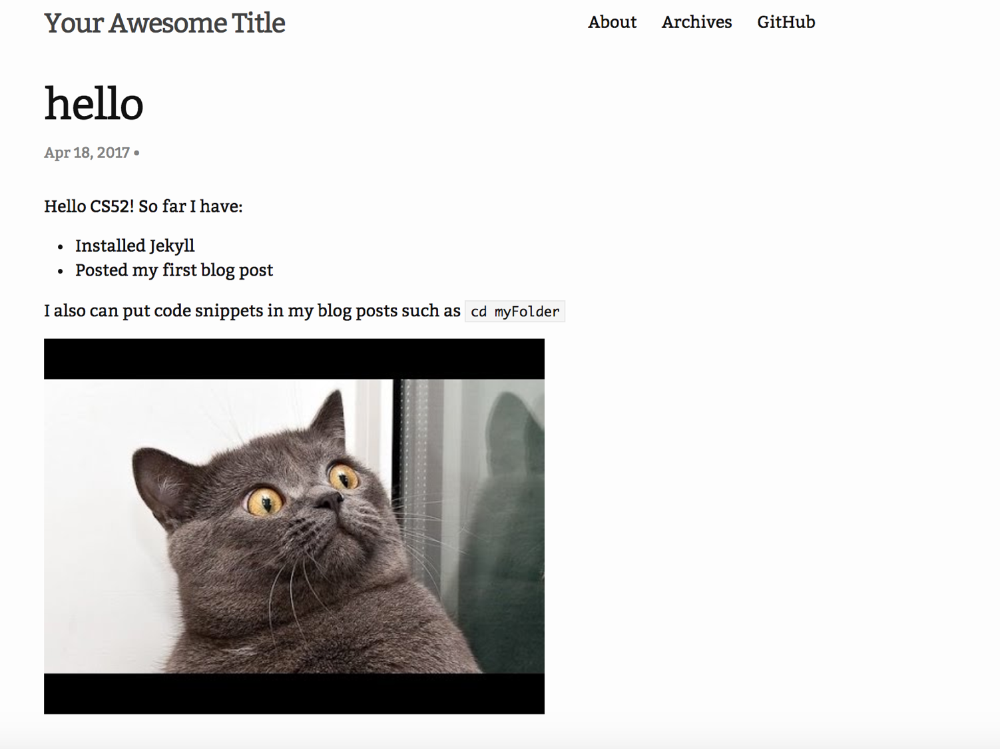
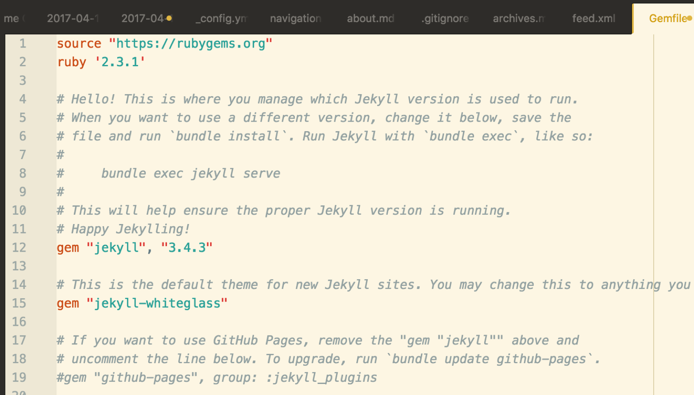

# jekyll Introductory Workshop!

[Jekyll](https://jekyllrb.com/) is a static site generator that automates a lot of the site creation progress. It's popular for personal and blogging sites. But don't confuse Jekyll with blogging software- although there are many templates available for use with Jekyll, Jekyll is fundamentally parsing software that makes it easier for you to make your website. Jekyll will interpret what you give it, be it markdown files, layout information etc. and construct your website.

Still confused? By the end of this workshop you will learn how you can use Jekyll to start a personal blogging website.

## Workshop Overview
To complete this workshop, follow the following steps:

1. [Getting Started- Install Jekyll](#getting-started)
2. [Start a new Jekyll Project](#starting-a-jekyll-project)
3. [Serve your first project](#serving-your-project-on-a-browser)
4. [Add a Theme](#adding-a-theme)
5. [Make your first post](#make-your-first-post)
6. [Customize your Theme](#customize-a-theme)
7. [Deploy to Github Pages](#deploy-to-github-pages)

Be sure to look out for the following notations:
* :computer: run in terminal
* :rocket: this is a key step
* :warning: watch out!
* :question: explanation section- what is going on here?
* :white_check_mark: checkpoint reached!

## Getting started

Before you start using jekyll, you need to install it first! The instructions for mac and windows installation are below.

### Mac
1. Your computer probably comes with Ruby installed! You can verify this with which ruby. If you don't get a path returned, you can easily install ruby with Homebrew. If you plan on doing more serious development with Ruby, you should look into an environment manager, like rbenv, but that's beyond the scope of this workshop.
2. Now you need to be able to install "gems", which are Ruby packages. RubyGems is the Ruby standard for publishing and managing third party libraries. If you installed Ruby with Homebrew or an environment manager, RubyGems should be installed by default. Check if you have gems installed by running the which gem command. If you don't get a path returned, you can download RubyGems here.
3. Last step: it's time to install some gems specific to Jekyll. To do this, simple execute gem install jekyll bundler. If you didn't install Ruby with homebrew or rbenv, you may have to run sudo gem install jekyll bundler.

#### What does the `bundler` gem do?

- Bundler provides a consistent environment for Ruby projects by tracking and installing the exact gems and versions that are needed.

### Windows
There's a known issue with Ruby on Windows that makes the installation process a little more difficult for first-time users. However, once RubyGems is installed correctly the first time, RubyGems will work just fine. More info can be found [here](http://guides.rubygems.org/ssl-certificate-update/#installing-using-update-packages).
1. Check if you already have Ruby installed. Run your terminal as an administrator (right click when opening and choose, "Run as administrator") and type `ruby -v`
   1. If that gives you a version number, go to step 2!
   2. If not, install Ruby (either by Chocolatey/your preferred Windows package manager or manually).
2. Gem is Ruby’s package manager (similar to NPM for Node). However, due to a bug with windows, in order to get Gem you need to download the gem file manually.
    1.  Go to [the RubyGems download site](https://rubygems.org/pages/download#formats). Choose the zip version, and unzip it in a easily-reachable directory (like C:\, C:\Documents, etc)
    2.  cd into the directory where you unzipped it.
    3. Run in terminal: `gem install --local your_directory_path\rubygems-update-2.6.10.gem `, replacing `your_directory_path` with the directory you chose. For example, my command says, `C:\>gem install --local C:\rubygems-update-2.6.10.gem`
3. Update RubyGems! type in terminal, `update_rubygems`.
4. To make sure the gem installed correctly, type `gem --version`.
    1. If that gives you a version number, great! Go to step 5. :smile:
5. The rubyUpdate gem can be safely uninstalled. Type `gem uninstall rubygems-update -x`.  


## Starting a jekyll project
:rocket: Now that you have the prerequisites set up, you can start your first jekyll site with the following command.
`jekyll new blogtitle`

`cd blog`

## Serving your project on a browser
The command `bundle exec jekyll serve` will run your files on `localhost:4000`
It’s a barebones look right now though- the default `minima` theme
You can now close the server with `ctrl+c`

## Adding a theme
Feel free to use choose your own theme from [JekyllThemes.org](http://jekyllthemes.org/), but we’ll be walking you through how to use the [`whiteglass` theme](https://github.com/yous/whiteglass).

Edit `_config.yml` to use whiteglass theme and its plugins (replace lines 29-31 with the following):


```
theme: jekyll-whiteglass
gems:
  - jekyll-archives
  - jekyll-paginate
  - jekyll-sitemap

permalink: /:year/:month/:day/:title/
paginate_path: /posts/:num/
paginate: 5

jekyll-archives:
  enabled:
    - categories
  layout: category_archives
  permalinks:
    category: /categories/:name/
```

Now, replace line 15 of your `Gemfile` with: `gem "jekyll-whiteglass"`

You can see what other plugins exist at https://jekyllrb.com/docs/plugins/#available-plugins

The theme also comes with some helpful defaults like an about and an archives page. You can add these files to your blog by running:
```
rm index.md
curl -L -O "https://github.com/yous/whiteglass/raw/master/{index.html,about.md,archives.md,feed.xml}"
curl -L --create-dirs -o _data/navigation.yml https://github.com/yous/whiteglass/raw/master/_data/navigation.yml
```

Because you added gems to `_config.yml` and `Gemfile`, you need to install them with `bundle install`

Now you can simply run `bundle exec jekyll serve` and the blog will be available at [http://127.0.0.1:4000](http://127.0.0.1:4000)

This is what your site should now look like:


## Make your First Post!
Now that your site is looking a little more aesthetically pleasing, let's make your first blog post. With Jekyll, you can maintain/publish a blog post simply by managing a folder of files on your computer.All of your posts will live in the folder `_posts`.

:rocket: To create a new post, make a new Markdown file within the `_posts` folder with the following format for the file name:
```
YEAR-MONTH-DAY-TITLE.md
```

For example to create a blog post titled 'hello world' enter the following into terminal:
```
touch 2017-04-18-hello-world.md
```
:rocket: At the top of this file, add the following lines of code.
```
---
layout: post
title:  "Hello World"
date:   2017-04-18 04:16:13 -0400
categories: jekyll
---
```

:question: The content in between the three-dashed lines is known as YAML Front Matter and Jekyll will parse these variables in converting your file into the HTML for your site. For example, the `layout` variable will tell Jekyll to utilize the `post` layout.

:warning: All blog post files must start with this YAML Front Matter!

:rocket: Now, underneath the YAML Front Matter, you can write the content of your Blog Post in Markdown.
For example, copy the following lines to the bottom of the file:
```

Hello CS52! So far I have:
* Installed Jekyll
* Posted my first blog post

I also can put code snippets in my blog posts such as
`cd myFolder`

```
:rocket: To add a picture to your post, you can use Markdown syntax for adding an image:
```


```
The following image should now appear in your blog post:


:white_check_mark: You have now successfully created a blog post! It should look something along the lines of this:


## What's Happening?
One of the best parts of using Jekyll is the ability to modularize your page layouts and your posts. Jekyll knows how to read that by the different folders in the directory. For example, the compiled site will be in the `_sites` folders (don't put files there, as they'll only be overwritten). Blog posts will be in `_posts`.

A popular practice with Jekyll is to _modularize_ your code-- that is, create elements of the page (ex headers, nav bars, footers) that have a predefined style and to include them as separate .html files.

Let's try customizing this theme's layout!

## Customize your Theme
####
#### Making a Layout
Create a directory called `_includes`.
```
mkdir _layouts
cd _layouts
```
Then, copy the file in `_includes/footer_content.html` and paste it into your newly-created `_includes` folder.
Copy and paste the following code to the end of your file:
```
<link rel="icon" type="image/x-icon" href="{{ "/favicon.ico" | relative_url }}">
```
Check to make sure your page still looks nice :)

This is the same method used to edit the CSS in the site.

## Deploy your site to Github Pages

#### Installing the Github-Pages gem
The final step is to deploy your site to Github Pages. Fortunately, a great benefit is that Github-Pages works very easily with Jekyll, especially with the `github-pages` gem.

:rocket: Open up the file named `Gemfile`in the project's root directory. Add the line
```
gem github-pages
```

Your `Gemfile` may have something similar to this following screenshot; follow the instructions and uncomment `gem github-pages`.



:rocket: Then, run
```
bundle install
```
followed by
```
bundle update
```
You have now bootstrapped an environment that closely mirrors Github-Pages and "Using it in your projects means that when you deploy your site to GitHub Pages, you will not be caught by unexpected differences between various versions of the gems." (Jekyll Official Docs)

#### Pushing to Github (Cited from Tania Rascia tutorial)
:rocket: Create a new empty repository in your Github account where the URL is:
```
http://github.com/your_username/repo_name
```
:rocket: Create a copy of the `_config.yml` file and name it `_config_dev.yml`.

:rocket: Then, modify the `baseurl` and `url` variables in the `_config.yml` file such that they are:

```
baseurl: "/repo_name"
url:"http://github.com/your_username"
```
:exclamation: To continue to serve your site locally, you should use the following:
```
jekyll serve --config _config_dev.yml
```

:rocket: Then, as we have done previously, we link our local repo to the github repo using
```
git remote add origin http://github.com/your_username/repo_name.git
```
:rocket: We then push to the `gh-pages` branch of our repository as follows:
```
git checkout -b github-pages
git add .
git commit -m "deploy site"
git push -u origin gh-pages
```
:white_check_mark: You have now successfully deployed your site to github-pages and should be able to access it at
```
http://github.com/your_username/repo_name
```
## Final Checklist
At this point you should understand how to, and have completed the following:
* :white_check_mark: Install Jekyll and created a new Jekyll site
* :white_check_mark:Install a theme
* :white_check_mark:Make a blog post using Jekyll
* :white_check_mark:Customize a theme
* :white_check_mark: Deployed your Jekyll site to github-pages

:rocket: To turn in the assignment please submit the URL for your deployed site!

#### Potential Extensions
Some potential extensions where you could take this include:
* :arrow_upper_right: Check out other themes at [Jekyll Themes](http://jekyllthemes.org/) and play around! There are a lot of different themes for various types of sites other than blogs, such as portfolios etc.
* :arrow_upper_right: Try creating your own 'theme'. The tutorial linked below on Starting Jekyll is a good starting place for this.

We hope that after this workshop you are now confident about how you can use Jekyll in the future!

## Sources
* [Official Jekyll Documentation](https://jekyllrb.com/docs/quickstart/)
* [More information on how Jekyll works](https://jekyllbootstrap.com/lessons/jekyll-introduction.html)
* [Tutorial on Starting Jekyll](https://www.taniarascia.com/make-a-static-website-with-jekyll/)
